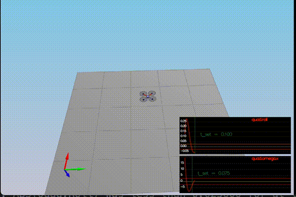
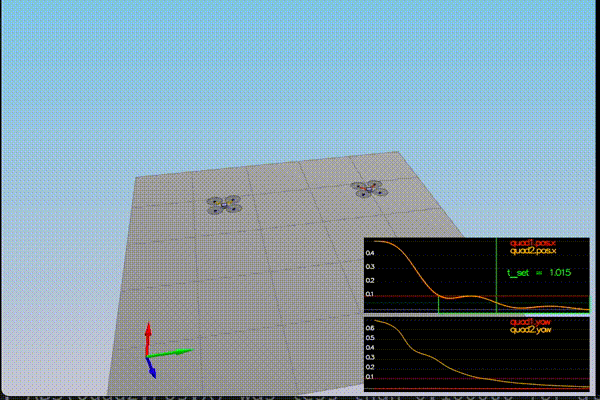

# Udacity FCND - Controller

### Project Goals
1. Compile and test the simulator.
2. Adjust quad `mass` to make it hover.
3. Implement the `GenerateMotorCommands` and `BodyRateControl`functions. Tune `kpPQR` parameter to get the vehicle to stop spinning.
4. Implement roll / pitch control using the `RollPitchControl` function. Tune `kpBank` to minimize settling time.
5. Implement `LateralPositionControl` and `AltitudeControl` functions. Tune parameters `kpPosXY` and `kpPosZ` , `kpVelXY` and `kpVelZ`.
6. Implement `YawControl`function . Tune `kpYaw`since one quad is rotated in yaw.
7. Explore the non-idealities present and robustness of the controller.


### Files
1. [QuadControlParams.txt](./QuadControlParams.txt)
2. [QuadControl.cpp](./QuadControl.cpp)


### Results of Scenarios
The .gif playback speed is increased. You can find the original videos [here](./videos/).
##### Scenario 1
Adjusted the mass to 0.5.

<p align="center">

</p>

##### Scenario 2
Implemented the body rate control functions.

<p align="center">

</p>


##### Scenario 3
Implemented roll/pitch contro and attitude control.

<p align="center">

</p>

##### Scenario 4
Exploring non-idealities.

<p align="center">

</p>

##### Scenario 5
Tracking trajectories.

<p align="center">

</p>

##### Other Tests

<p align="center">

</p>

### C++ controller implementation
Udacity provides a [project link](https://github.com/udacity/FCND-Controls-CPP) with the simulator implementation and placeholders for the controller code. The project README.md provides a guide to run the project and information on the tasks to be executed for implementing the controller. There are five scenarios we need to cover (as shown above). The simulator runs a scenario in a loop and in the command line prints whether the functions implemented for the controller `PASS` or `FAIL`.

The cascaded controller being implemented has the following structure (taken from Udacity) -

<p align="center">

</p>


1. Body rate control function

```
  V3F momentI;

  V3F I;
    I.x = Ixx;
    I.y = Iyy;
    I.z = Izz;
    momentCmd = I * kpPQR * ( pqrCmd - pqr );
 ```
2. Motor Commands function update

```
float l = L / sqrtf(2.f);
  float t1 = momentCmd.x / l; // rot x
  float t2 = momentCmd.y / l; // rot y
  float t3 = - momentCmd.z / kappa; // rot z
  float t4 = collThrustCmd; // total

  cmd.desiredThrustsN[0] = (t1 + t2 + t3 + t4)/4.f;  // front left
  cmd.desiredThrustsN[1] = (-t1 + t2 - t3 + t4)/4.f; // front right
  cmd.desiredThrustsN[2] = (t1 - t2 - t3 + t4)/4.f ; // rear left
  cmd.desiredThrustsN[3] = (-t1 - t2 + t3 + t4)/4.f; // rear right
```

3. Roll/Pitch control function

```
float BX_t = 0.0; // target X
  float BY_t = 0.0; // target Y
  if (collThrustCmd > 0.0)
  {
      float c = collThrustCmd/mass;
      BX_t = -CONSTRAIN(accelCmd.x/c, -maxTiltAngle, maxTiltAngle);
      BY_t = -CONSTRAIN(accelCmd.y/c, -maxTiltAngle, maxTiltAngle);
  }
  float BX = BX_t - R(0, 2);
  float BY = BY_t - R(1, 2);

  pqrCmd.x = kpBank *((R(1, 0) * BX) - (R(0, 0) * BY)) / R(2, 2);
  pqrCmd.y = kpBank *((R(1, 1) * BX) - (R(0, 1) * BY)) / R(2, 2);
  pqrCmd.z = 0.f;
```

4. Attitude control function

```
float b_z = R(2,2);

 float err_z = posZCmd - posZ;

 integrated_Alt_Err += err_z * dt;

 //PID control altitude controller

 float p = kpPosZ * err_z;
 float i = KiPosZ * integrated_Alt_Err;


 float velZRef = velZCmd + p + i;
 velZRef = -CONSTRAIN(-velZRef, -maxDescentRate, maxAscentRate); // as suggested

 float err_z_vel = velZRef - velZ; // z velocity error
 float d = kpVelZ * err_z_vel;

 float accelCmd = accelZCmd + d;
 thrust = mass * (9.81f - (accelCmd / b_z));
 ```

 5. Lateral Position Control

```
 velCmd.constrain(-maxSpeedXY,maxSpeedXY);

  V3F posErr = posCmd - pos; // position error
  V3F velErr = velCmd - vel; // velocity error

  accelCmd = accelCmdFF + (kpPosXY * posErr) + (kpVelXY * velErr); //z compent is zero, so let's ignore use kpPosXY/kpVelXY for pos.z/vel.z as well
  accelCmd.constrain(-maxAccelXY,maxAccelXY);

  accelCmd.z = 0;
```

6. Yaw Control function

```
yawCmd = fmod(yawCmd, (2.0f*F_PI));

if (yawCmd <= -F_PI)
{
   yawCmd += (2.0f*F_PI);
}
else if (yawCmd > F_PI)
{
   yawCmd -= (2.0f*F_PI);
}

yawRateCmd = kpYaw * (yawCmd - yaw);

```
### Flight Evaluation
Combined results of the 5 Scenarios.

```
# Scenario 1
PASS: ABS(Quad.PosFollowErr) was less than 0.500000 for at least 0.800000 seconds
# Scenario 2
PASS: ABS(Quad.Roll) was less than 0.025000 for at least 0.750000 seconds
PASS: ABS(Quad.Omega.X) was less than 2.500000 for at least 0.750000 seconds
# Scenario 3
PASS: ABS(Quad1.Pos.X) was less than 0.100000 for at least 1.250000 seconds
PASS: ABS(Quad2.Pos.X) was less than 0.100000 for at least 1.250000 seconds
PASS: ABS(Quad2.Yaw) was less than 0.100000 for at least 1.000000 seconds
# Scenario 4
PASS: ABS(Quad1.PosFollowErr) was less than 0.100000 for at least 1.500000 seconds
PASS: ABS(Quad2.PosFollowErr) was less than 0.100000 for at least 1.500000 seconds
PASS: ABS(Quad3.PosFollowErr) was less than 0.100000 for at least 1.500000 seconds
# Scenario 5
PASS: ABS(Quad2.PosFollowErr) was less than 0.250000 for at least 3.000000 seconds
```
## Acknowledgements
Thanks to Fotokite for the initial development of the project code and simulator.

Udacity Project FCND - Controller
Author: Siddhant Tandon
Date: 9 June 2020
