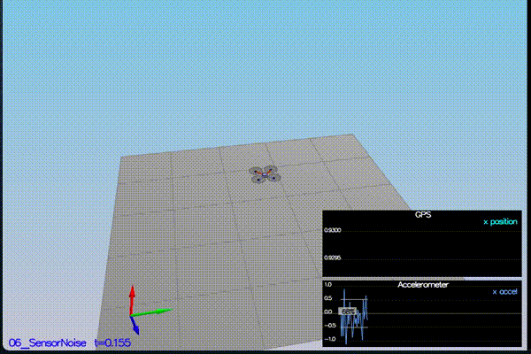
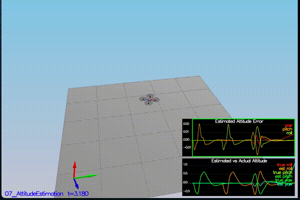
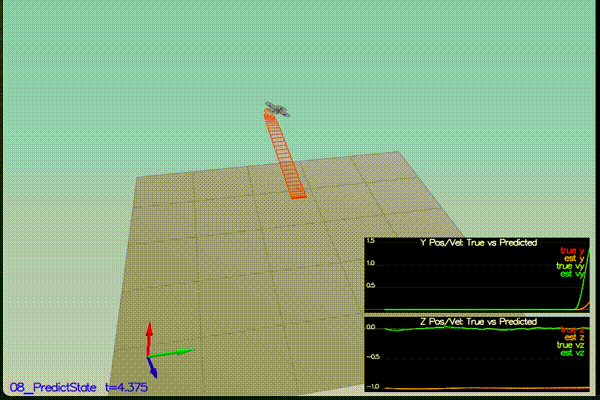
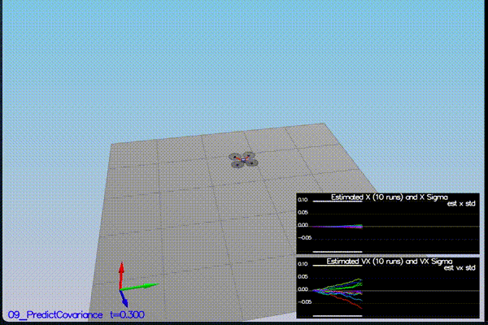
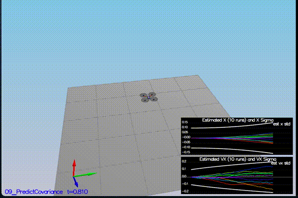
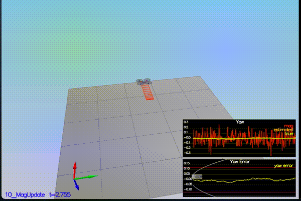
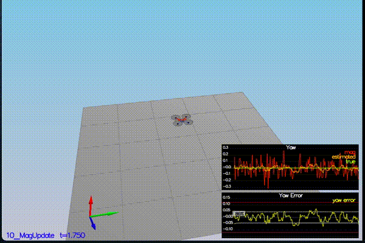
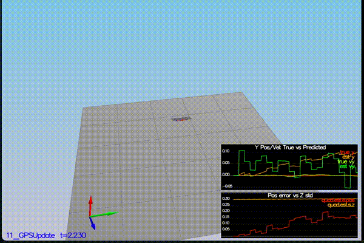
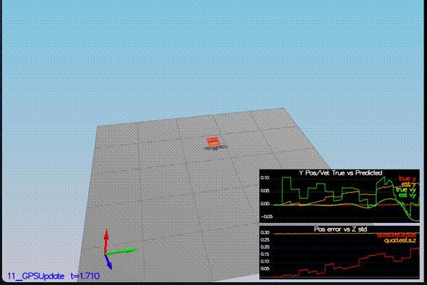
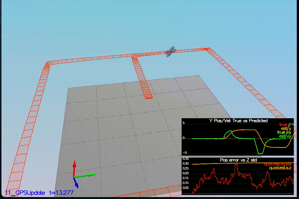

# Udacity FCND - Estimation


### Project Goals
1. Determine noise in both GPS X data and Accelerometer X data
2. Gyro altitude integratior
3. Implementation of the estimator
4. Updating the Magnetometer
5. Improving performance through GPS update
6. Using your previous controller and tuning it


### Files
- [`QuadEstimatorEKF.cpp`](./QuadEstimatorEKF.cpp)
- [`QuadEstimatorEKF.txt`](./QuadEstimatorEKF.txt)
- [`QuadController.cpp`](./QuadController.cpp)
- [`QuadControlParams.txt`](./QuadControlParams.txt)


### Implementation

**Step 1: Sensor Noise**
  - The standard devations were calucated for both the files `Graph1.txt` and `Graph2.txt` and were then updated in the `06_SensorNoise.txt` file. The values are:
```
MeasuredStdDev_GPSPosXY = 0.776012216
MeasuredStdDev_AccelXY = 0.514036636
```
  We can see the result after that below.
  <p align="center">
  
  </p>

  - Flight Evaluation
  ```
  06_SensorNoise:
  PASS: ABS(Quad.GPS.X-Quad.Pos.X) was less than MeasuredStdDev_GPSPosXY for 72% of the time
  PASS: ABS(Quad.IMU.AX-0.000000) was less than MeasuredStdDev_AccelXY for 69% of the time
  ```

**Step 2: UpdateFromIMU() Function Writeup**

  - The integration of this function can be found in [QuadEstimatorEKF](./QuadEstimatorEKF.cpp#L95).

  - It follows the update of pitch and roll using the integrated gyroscope values.
  <p align="center">
  
  </p>

  - Flight Evaluation
```
07_AttitudeEstimation:
PASS: ABS(Quad.Est.E.MaxEuler) was less than 0.100000 for at least 3.000000 seconds
```

**Step 3: Prediction**

  -  Here we first predict the accelerometer measurement. And the we see the estimator causing the drone drift away.

<p align="center">

</p>

  - After we update the [`PredictState`](./QuadEstimatorEKF.cpp#L254), we can see significant improvement.

  - Now we make things more realistic by introducing noise. Below we can see its effect.

<p align="center">

</p>

  - Then we want to predict covariance. Before that we update [`GetRbgPrime`](./QuadEstimatorEKF.cpp#L247) and rest of the `Predict()` function.

  - After that we tune `QPosXYStd` and `QVelXYStd` in [`QuadEstimatorEKF.txt`](./QuadEstimatorEKF.txt). We get comparable results.

<p align="center">

</p>

**Step 4: Magnetometer**

  - Now we need to update the state with magnetometer data. Below we see the graph without any implementation yet.

<p align="center">

</p>

  - Now we tune [`QYawStd`](./QuadEstimatorEKF.txt) and implement the function ['UpdateFromMag()'](./QuadEstimatorEKF.cpp#L321). Then we can see the performance of the drone below as compared to before.

<p align="center">

</p>


**Step 5: GPS**

  - Now we implement a closed loop GPS update to our state and reduce position and velocity errors. So in the function [`UpdateFromGPS()`](./QuadEstimatorEKF.cpp#L293). Result is below.
<p align="center">

</p>

  - Flight Evaluation
```
11_GPSUpdate:
PASS: ABS(Quad.Est.E.Pos) was less than 1.000000 for at least 20.000000 seconds
```

**Step 6: Conroller From Last Project**

  - Replacing `QuadController.cpp` and `QuadControlParams.txt` with the ones from [previous project](https://github.com/SiddhantTandon/Udacity_FlyingAutonomousCar/tree/master/Controller). We expect to see poor performance since the tuning is not proper.
  -
<p align="center">

</p>

  - Finally we tune parameters in [`QuadControlParams.txt`](./QuadControlParams.txt), to get the following result.
  
<p align="center">

</p>

### Notes
Why do the simulations dont work (Step 1 - 5) with the controller implementation from previous project vs the controller that came with this project ?

### Acknowledgements
Thanks to Fotokite for the initial development of the project code and simulator.

Udacity Project FCND - Estimator

Author: SiddhantTandon

Date: June 9 2020
